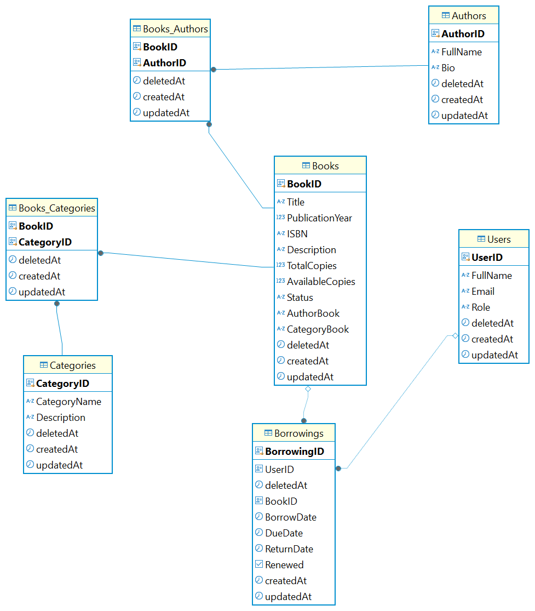

# Library Management System

This is a **Library Management System** built using **Node.js**, **Express**, **TypeScript**, **Next.js**, and **PostgreSQL**. It is designed to efficiently manage library operations such as book, author, category, and user management.

## Technologies Used

- **Backend**: Node.js, Express, TypeScript
- **Frontend**: Next.js (React-based framework)
- **Database**: PostgreSQL
- **API Testing**: Postman
- **ORM**: Sequelize
- **Environment Management**: Dotenv

## Features

- **Book Management**: Create, read, update, and delete books. Manage book availability, status, and borrowing records.
- **Author Management**: Manage author details including their name, bio, and other information.
- **Category Management**: Classify books into categories such as Fiction, Non-Fiction, etc.
- **User Management**: Add and manage users, track user roles (Admin/User), and update user details.
- **Borrowing System**: Allows users to borrow, return, and renew books.
  
## Prerequisites

- **Node.js**: [Download & Install](https://nodejs.org/)
- **PostgreSQL**: [Download & Install](https://www.postgresql.org/download/)
- **Git**: [Download & Install](https://git-scm.com/)

## Installation

Follow these steps to set up the project locally:

### 1. Clone the repository
```bash
git clone https://github.com/pchihieuu/library-management
```
### 2. Navigate into the project directory
```bash
cd library-management-system
cd backend
```
### 3. Install dependencies
```bash 
npm install
```
## 4. Set up environment variables

Create a .env file in the root directory and configure your PostgreSQL credentials:
```bash
DB_HOST=localhost
DB_PORT=YOUR_PORT
DB_USER=YOUR_PG_USER
DB_PASSWORD=YOUR_PG_PASSWORD
DB_NAME=YOUR_DATABASE
```
### 5. Run database migrations
Make sure PostgreSQL is running and execute the migrations to set up the database:
```bash
npx sequelize-cli db:migrate
```

### 6. Run the application
```bash
npm run dev
```
The backend server will run on http://localhost:5000, and the frontend NextJS application will be available at http://localhost:3000.

## API Documentation
The API is documented using Postman. You can explore and test the available API endpoints via the following link:
[Library Management API Documentation](https://s.net.vn/wVhB)

## ERD Diagram

Here is the **Entity-Relationship Diagram (ERD)** of the library management system:



## Testing API
To test the API, we recommend using Postman. You can import the Postman collection into your Postman workspace by following these steps:

Go to File → Import in Postman.
Select the Import from Link option.
Paste the Postman collection link provided above.
### Example Test Data for Book Management API
Create Book Request
URL: POST /books
Body:
```bash
{
    "Title": "1982",
    "AuthorBook": "George Orwell",
    "PublicationYear": 1930,
    "ISBN": "978-0451524921",
    "Description": "A dystopian novel set in a totalitarian society under constant surveillance, where the government controls everything.",
    "TotalCopies": 100,
    "AvailableCopies": 55,
    "Status": "available",
    "CategoryBook": "Dystopian"
  }
```

Update Book Request
URL: PUT /books/:id
Body:
```bash
{
    "TotalCopies": 200
}
```
